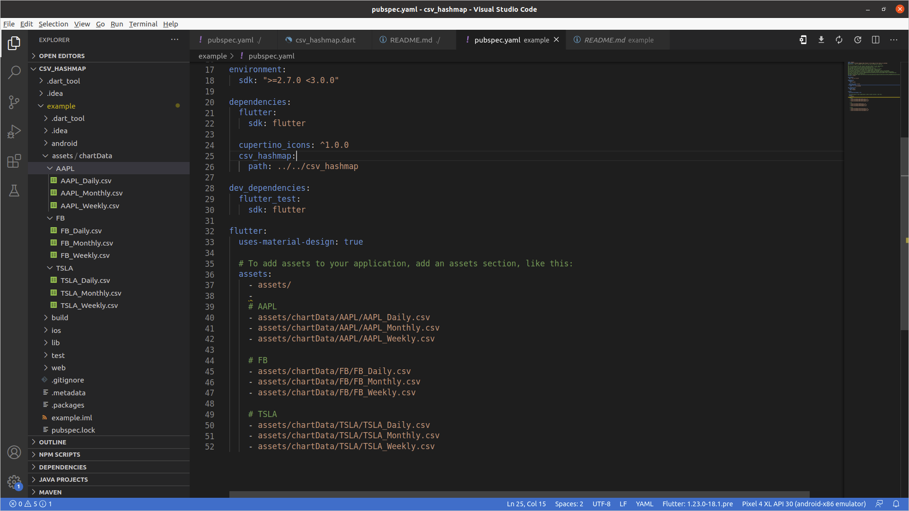

A composable, Future-based library for convert the .csv file to HashMap.

[](https://pub.dev/packages/http)
[](https://travis-ci.org/dart-lang/http)

This package enable you to convert your .csv file (from your local assets folder) to HashMap format. It's multi-platform, and supports mobile, desktop,
and the browser.
# Demo


## Using

The easiest way to use this library is via the CSV_HashMap Object to call hashMapConvertor() to get back the hashMap. To use the hashMap Converter(), you need to define your sets of columns key of .csv file as the List with the key of columns & define your path of .csv file as a String. Please make sure that you already include your .csv file at the pubspec.yaml and the csvPath are correct.

The Usage of this library please check out from the example flutter project
Csv file need to be placed on the assets directory & inclueded those corresponding path in the pubspec.yaml



```dart
Example csv file format
Date,Open,High,Low,Close,Adj Close,Volume
2010-06-29,3.800000,5.000000,3.508000,4.778000,4.778000,93831500
2010-06-30,5.158000,6.084000,4.660000,4.766000,4.766000,85935500
2010-07-01,5.000000,5.184000,4.054000,4.392000,4.392000,41094000
2010-07-02,4.600000,4.620000,3.742000,3.840000,3.840000,25699000
2010-07-06,4.000000,4.000000,3.166000,3.222000,3.222000,34334500
2010-07-07,3.280000,3.326000,2.996000,3.160000,3.160000,34608500
```

```dart
import 'package:csv_hashmap/csv_hashmap.dart';

// Create the private variable _refHashMap
HashMap _refHashMap;

// TODO: Create the async void func for handling the conversion of .csv file to HashMap
void csvHandler() async{
     _refHashMap = await CSV_HashMap().hashMapConvertor(
          refList: ["data","open", "high", "low", "close", "adjClose", "vol"], csvPath: "assets/chartData/TSLA/TSLA_Daily.csv");
     // Check with the value of the _refHashMap with Key - "data"
     print(_refHashMap["data"]);
}

// Output
I/flutter: [ 2010-06-29,  2010-06-30,  2010-07-01,  2010-07-02,  2010-07-06,  2010-07-07,  2010-07-08,  2010-07-09,  2010-07-12,  2010-07-13,  2010-07-14,  2010-07-15,  2010-07-16,  2010-07-19,  2010-07-20,  2010-07-21,  2010-07-22,  2010-07-23,  2010-07-26,  2010-07-27,  2010-07-28,  2010-07-29,  2010-07-30,  2010-08-02,  2010-08-03,  2010-08-04,  2010-08-05,  2010-08-06,  2010-08-09,  2010-08-10,  2010-08-11,  2010-08-12,  2010-08-13,  2010-08-16,  2010-08-17,  2010-08-18,  2010-08-19,  2010-08-20,  2010-08-23,  2010-08-24,  2010-08-25,  2010-08-26,  2010-08-27,  2010-08-30,  2010-08-31,  2010-09-01,  2010-09-02,  2010-09-03,  2010-09-07,  2010-09-08,  2010-09-09,  2010-09-10,  2010-09-13,  2010-09-14,  2010-09-15,  2010-09-16,  2010-09-17,  2010-09-20,  2010-09-21,  2010-09-22,  2010-09-23,  2010-09-24,  2010-09-27,  2010-09-28,  2010-09-29,  2010-09-30,  2010-10-01,  2010-10-04,  2010-10-05,  2010-10-06,  2010-10-07,  2010-10-08,  2010-10-11,  2010-10-12,  2010-10-13,  2010-10-14,  2010-10-15,  2010-10-18,  2010-10 ...  ...  ...  ...
```

* You would clone the project from this repository to test with this library through running the example project 